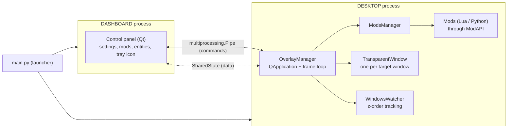

# Project architecture

## Overview

The application runs as two independent processes started by `main.py`, plus a log queue shared by all processes.



| Process       | Responsibility                                                                           |
|---------------|------------------------------------------------------------------------------------------|
| **DASHBOARD** | Control panel: settings, mod list, entity list and spawning, translations, tray icon.    |
| **DESKTOP**   | Everything drawn on the desktop: mods, overlay layers, z-order handling, mouse input.    |

## Communication between processes

Two mechanisms are used together:

- **Commands** are Python lists of strings sent with `multiprocessing.Pipe`. The first element is the command name. A command usually only tells the other side that the data changed.
- **Data** lives in `SharedState` (`shared_state.py`). Each process keeps a local copy and refreshes it when read and `pull()` is called.

## Mods

`ModsManager` scans `Mods/` and reads `about.json` of each folder. On startup `run_mods` starts every enabled mod:

- **Lua**: a separate `LuaRuntime` per mod with dangerous globals removed and an attribute filter.
- **Python**: `main.py` is loaded as a module (`mod_<id>`) with `ModAPI` and `print` injected into its namespace. There is no sandbox, see [Mod security](modding/security.md).

Mods talk to the application only through [`ModAPI`](modding/api-reference.md) (`desktop/mod_api.py`).

## Project layout

```text
.github/                    Issue and pull request templates, CI workflows
Assets/                     Sounds, animations, object images
dashboard/                  Dashboard process
  dashboard.py              Control panel
  objects_editor.py         Editor of object hitboxes and physics properties
  translator.py             Runtime language switching
  ui/                       Qt Designer generated layouts
  widgets/                  Reusable widgets
desktop/                    Desktop process
  overlay_manager.py        Overlay layers and the frame loop
  mods_manager.py           Loading and running mods
  mod_api.py                ModAPI given to mods
  input_events.py           Input data types (input states, key names, clicks, scroll)
  physics_utils.py          Collision detection, shapes, Box2D conversions, geometry helpers
docs/                       Project documentation
logs/                       User debug logs
Mods/                       User mods
tests/                      Automated tests
tools/                      Developer scripts
  create_exe.py             Executable builder. Packages the application into a standalone `.exe` using PyInstaller.
  run_tests.py              Test runner. Runs the full code-quality pipeline: Ruff linting, MyPy type checking, dependency verification via `pipreqs`, and the pytest test suite.
  update_languages.py       Translation updater. Automates the Qt translation workflow — regenerates `.ts` files from the source code and compiles them into `.qm` files.
  generate_lua_stubs.py     Lua definitions updater. Generates a `mod_api.lua` file used to add autocomplete and better code formatting in mod scripts.
  generate_python_stubs.py  Python definitions updater. Generates a `mod_api.pyi` file used to add autocomplete and better code formatting in mod scripts.
translations/               Qt translation sources (.ts); compiled .qm files are generated locally
windows_z_order/
  neighbors.py              Windows directly above and below a given hwnd
  watcher.py                Window event listener keeping the z-order list up to date
.gitignore
.luarc.json
CODE_OF_CONDUCT.md
CONTRIBUTING.md
LICENSE.txt
README.md
config.py                   Paths and application constants
icon.ico
logger.py                   Multi-process logging, log files, automatic cleanup
main.py                     Launcher: starts the DASHBOARD and DESKTOP processes
pyproject.toml              Dependencies (uv)
settings.default.json       Defaults used to create settings.json
shared_state.py             SharedState: cross-process data with pull()
shared_state.pyi
utils_debug.py              Debug window, hitbox rendering, helpers
uv.lock                     lockfile (do not edit by hand)
version.json                Version and its date
```


### Legacy modules

`desktop/app.py`, `desktop/pet.py` and `desktop/world_objects.py` belong to the previous, non-mod implementation of the
pet and its objects. They are not used by the current engine and are waiting to be reworked for the mod system.
