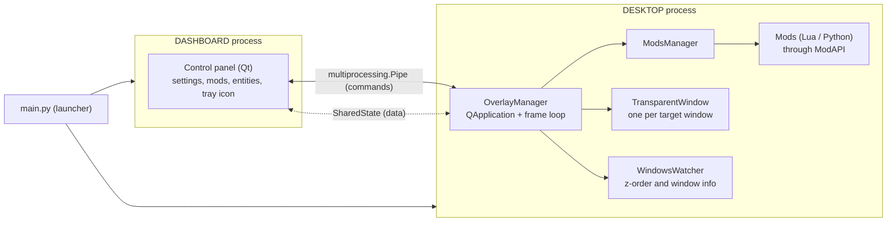

# Project architecture

## Overview

The application runs as two independent processes started by `main.py`, plus a log queue shared by all processes.


```mermaid
flowchart LR
    main["main.py (launcher)"]
    subgraph dash["DASHBOARD process"]
        ui["Control panel (Qt)<br/>settings, mods, entities, tray icon"]
    end
    subgraph desk["DESKTOP process"]
        om["OverlayManager<br/>QApplication + frame loop"]
        mm["ModsManager"]
        mods["Mods (Lua / Python)<br/>through ModAPI"]
        tw["TransparentWindow<br/>one per target window"]
        ww["WindowsWatcher<br/>z-order and window info"]
        om --> mm --> mods
        om --> tw
        om --> ww
    end
    main --> dash
    main --> desk
    ui <-->|"multiprocessing.Pipe (commands)"| om
    ui <-.->|"SharedState (data)"| om
```

| Process       | Responsibility                                                                           |
|---------------|------------------------------------------------------------------------------------------|
| **DASHBOARD** | Control panel: settings, mod list, entity list and spawning, translations, tray icon.    |
| **DESKTOP**   | Everything drawn on the desktop: mods, overlay layers, z-order handling, mouse input.    |

## Communication between processes

Two mechanisms are used together:

- **Commands** are Python lists of strings sent with `multiprocessing.Pipe`. The first element is the command name. A command usually only tells the other side that the data changed.
- **Data** lives in `SharedState` (`shared_state.py`). Each process keeps a local copy of the values; `pull()` marks it as stale and a value is re-read from the shared state on its next access (details: the docstring of `SharedState`).

## Mods

`ModsManager` scans `Mods/` and reads `about.json` of each folder. On startup `run_mods` starts every enabled mod, in the order saved in the settings:

- **Lua**: a separate `LuaRuntime` per mod.
- **Python**: `main.py` is loaded as a module (`mod_<id>`) with `ModAPI` and `print` injected into its namespace.

What mods can and cannot do: [Mod security](modding/security.md). Mods talk to the application only through [`ModAPI`](modding/api-reference.md) (`app/desktop/mod_api.py`), which is also the source of the generated editor stubs. How mods are written is described in the [modding documentation](README.md#for-mod-authors).

## Frame loop

`OverlayManager.tick` is driven by a Qt timer in the DESKTOP process, at the `FPS` set in `settings.json`. Every frame:

1. `SharedState.pull()` refreshes the local copy of the shared data.
2. Pending commands from the DASHBOARD are handled (spawn, kill, show, hide and teleport an entity; kill, show and hide all entities; close the application).
3. `WindowsWatcher.clear_cache()` drops the cached window information, but only if the z-order changed since the last frame.
4. All drawing commands of the previous frame are cleared and `ModsManager.tick()` runs: global mod `tick`, instance `tick_func`, publishing the details of the selected entity, advancing the mouse button states and resetting the scroll ([rules](modding/api-reference.md#concepts)), and sending the spawnable entity list to the DASHBOARD when it changed.
5. A `TransparentWindow` layer is created for every window that has drawing commands and placed directly above that window in the z-order (one `DeferWindowPos` batch). Layers of windows that have nothing to draw are closed.
6. Every layer is repainted with its commands.

Mouse input goes the other way: each layer receives the Qt mouse and wheel events, hit-tests them against the shapes drawn with a `hit_id` (rules in the [API reference](modding/api-reference.md#concepts)) and stores the result in `ModsManager`, where `ModAPI` reads it during the next frame.

## Project layout

```text
.github/                    Issue and pull request templates, CI workflows
app/
  Assets/                   Images and other resources of the control panel
  dashboard/                Dashboard process
    dashboard.py            Control panel
    objects_editor.py       Editor of object hitboxes and physics properties
    translator.py           Runtime language switching
    ui/                     Qt Designer generated layouts
    widgets/                Reusable widgets
  desktop/                  Desktop process
    overlay_manager.py      Overlay layers and the frame loop
    mods_manager.py         Loading and running mods
    mod_api.py              ModAPI given to mods
    input_events.py         Input data types (input states, key names, clicks, scroll)
    physics_utils.py        Rectangle types, shapes, Box2D conversions, geometry helpers
  logs/                     User debug logs
  Mods/                     User mods
  translations/             Qt translation sources (.ts); compiled .qm files are generated locally
  windows_z_order/
    neighbors.py            Windows directly above and below a given hwnd
    watcher.py              Win32 event listener (WinEvent hooks) with cached z-order neighbors, window rectangles, titles and states
  config.py                 Paths and application constants
  icon.ico
  logger.py                 Multi-process logging, log files, automatic cleanup
  main.py                   Launcher: starts the DASHBOARD and DESKTOP processes
  settings.py               Settings management: defines default values, loads runtime config, and creates settings.json
  shared_state.py           SharedState: cross-process data with pull()
  shared_state.pyi          Type hints of the `SharedState` attributes
  utils_debug.py            Debug window, hitbox rendering, helpers
  version.json              Version and its date

docs/                       Project documentation
tests/                      Automated tests
tools/                      Developer scripts
  create_exe.py             Builds a standalone `.exe` with PyInstaller
  run_tests.py              Quality pipeline: Ruff, MyPy, Pipreqs, Pytest
  update_languages.py       Regenerates the `.ts` translation files and compiles them to `.qm`
  generate_lua_stubs.py     Generates `mod_api.lua`, the Lua editor stub
  generate_python_stubs.py  Generates `mod_api.pyi`, the Python editor stub
  stub_common.py            Generates the editor stubs of ModAPI
.gitignore
.luarc.json
CODE_OF_CONDUCT.md
CONTRIBUTING.md
LICENSE.txt
pyproject.toml              Dependencies (uv)
README.md
SECURITY.md
uv.lock                     lockfile (do not edit by hand)
```
